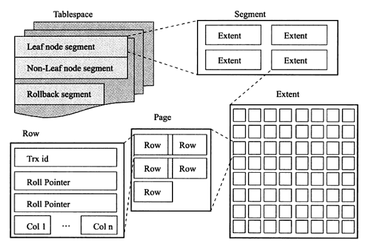
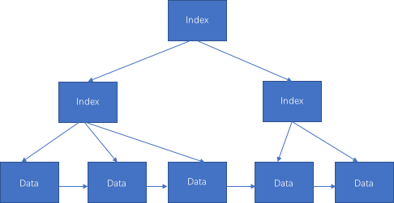

这里限定 MySQL InnoDB 存储引擎来进行阐述，避免不必要的阅读歧义。

首先通过一篇文章简要了解下 B 树的相关知识：[你好，我是B树](https://www.cnblogs.com/niejunlei/p/15034152.html) 。

B+ 树是在 B 树基础上的变种，主要区别包括：

- 1、所有数据都存储在叶节点，其它节点作为索引存储。

- 2、数据节点添加链指针，便于横向检索。

**数据是怎么检索的？**

从根节点作为起始检索点，逐层向下检索，直至找到目标数据。检索的路径复杂度度跟树的高度成正比。

如上第一点，B+ 树所有数据存储于叶子节点，那么路径上就可以存储更多的索引指针数据，进而使得数据的高度降低。能够极大的提升检索效率。

**InnoDB 数据文件空间管理**

Tablespaces -> Segments -> Extends -> Pages 级联。

Page <-> Row

Page 是 MySQL 最小的存储管理单元，默认的大小为 16KB。最大行数据需要稍微小于 Page 大小的 1/2，超过的化作额外存储处理。

Page <-> B+ 树

MySQL InnoDB 表会使用一种特殊的索引聚簇索引来存储行数据，索引中会包含主键数据。

索引的底层数据结果为 B+ 树（其它特殊此处不做赘述）。

如下图：

一个节点对应一个 Page，MySQL 每次读取的基本操作单元。

**B+ 树的高度与表数据存储量大小**

I：索引节点，每个节点可存储的指针数。

H：树的高度。

R：叶节点，每个节点可以存储的记录数。

一张表可以存储的记录数：N = pow(I, H - 1) * R。

