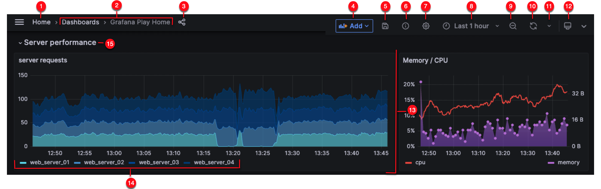

什么是高可用？

以年为单位，一年时间为 t = 365 * 24 * 60 = 525600 分钟。

服务可用性一般以实现几个9目标来评判，不目标下允许的不可用时间如下：

4个9：t * (1 - 99.99%) = 52.56 分钟。

5个9：t * (1 - 99.999%) = 5.256 分钟。

对于一般性互联网服务比较合理的目标设置为4个9，也就是综合允许1小时左右不可用时间。

那么，一个服务做到何种境况，才能实现如此的目标呢？

# 一、负载均衡

负载均衡是个好东西，它使得我们可以通过特定的策略（轮训、权重等）来将请求流量分配到支撑的的服务

负载均衡是一种策略，它可以存在于任何多对一的集群中间环节。

LVS：Linux Virtual Server Linux 虚拟服务器，高效廉价负载均衡器，一般作为外部流量入口。

rpc 服务：服务发现客户端通过特定的负载均衡策略和服务提供端进行交互。

数据库服务：应用服务请求多实例数据库服务（一主多备或双主多备）。

线程池：均衡线程分配任务。

... ... 等等。

# 二、集群策略

什么是集群？

只要多于1个就可以称之为集群。

反向代理服务集群、应用服务集群、数据库群、分布式缓存集群、消息队列服务器集群等等。

集群策略就像 planA、planB、planC ...，挂了一个实例还有另外一个，是负载均衡策略服务的对象。

不同层面的集群，参与其中的实例角色地位可能会略有差异，如主备、镜像等。

对此也会有相应的的伺服监控、角色切换辅助功能支持。

# 三、灾备

鸡蛋不要放在一个篮子里。篮子翻了，所有的鸡蛋就都砸了。

两个服务是对一个服务的灾备。

两个机房是对单个机房的灾备。

异地是对当地服务的灾备。

双活是对单活的灾备。

需要做到什么程度就要看业务的性质及不同业务的核心程度了。

# 四、监控，预警、自动化机制

监控很重要、非常重要。

服务的状态需要实时展现及历史留痕。

你需要有一套健康服务的标准作基线。

服务偏离基线时需要有相应的实时通知及响应机制。

预警，则重在预。

他是基于监控之上的，通过对趋势的预测来及时发现问题隐患，消灭问题于发生之前。

自动化机制可以是一种补充。

应对流量的限流、熔断、降级及服务实例的自动伸缩。

响应超时或者异常的服务重试机制。

服务集群实例角色主备切换。

机房同城、异地切换。

... ... 等等。

