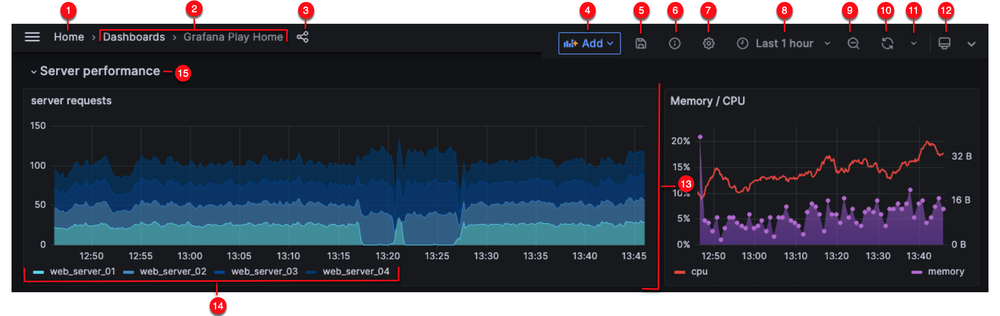
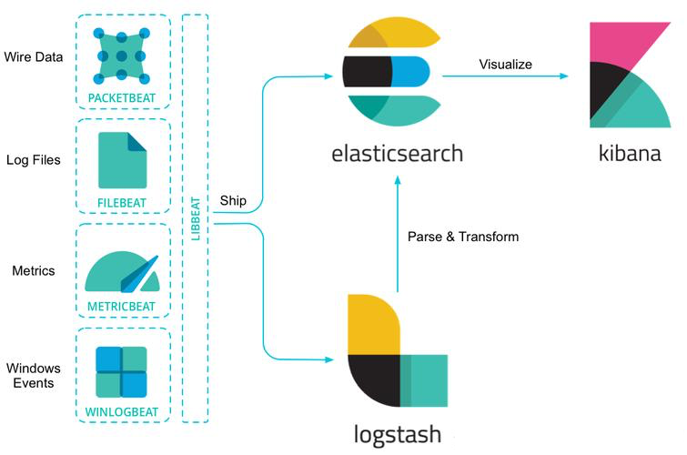

#一、服务检查

一般从早上八点开始，服务的访问量就会渐渐地升起来，初始爬坡会比较缓，大概到10点左右会走到顶峰，然后会趋向平稳波动。

作为公司的后台服务研发人员，早上到公司第一件事情就是打开监控，查看服务的各项指标是否正常，及时解决各种突发状况。

监控系统是 Prometheus + Grafana， Prometheus 负责监控数据层面获取处理，Grafana 负责监控数据面板展示及报警预警。

---

* 基础面板
    
    基础面板包括于各个服务，主要指标有 CPU、Mem、I/O、网卡带宽、进程存活等        

* 应用服务监控面板

    整体：qps、延迟、线程池，异常相应率等。

    接口层级：qps、延迟。

* 数据服务监控面板

    mysql：qps、连接数、主从延迟、slow log等。

    redis：qps、延迟、连接数、容量、键增量，键过期、慢查询等。

    mq：业务通道消息量及消费状况，

* 报警预警

    监控系统支持阈值触发报警，实时发送通讯软件接收，相当于 OnCall 状态了。

---

一套成熟完善的监控系统对于掌控服务状态是必需的，而且至关重要。它需要涵盖整个服务链条，包括流量入口网关、应用服务、数据服务、网络等。

除此之外，还需要结合日志系统来综合评估服务的健康状况。通常需要检查各个级别日志率。如error 日志量、整体的日志增量等。

日志系统，ELK 一套定制，filebeat 做日志收集，kafka 数据传送、logstash 数据格式处理转换、elasticsearch、kibana 数据查询展示。也可以做一些简单的近实时统计性预警。

检查完系统，大概需要15分钟左右。如果没有特别需要处理的问题，那么就进入下一阶段任务处理。

#二、日程回顾及安排

到这里基本就是组内信息汇集，沟通，协调环节。

每个人手里的工作进度，是否有阻塞的问题，内外部资源需求，当天的工作计划等。

这是一个很重要的环节，保持组内信息互通及一致性是维持团队正常、高效协作的基础。

例如，一个对于对于 A 来说比较麻烦的问题，可能 B 已经处理过了，A 如果再解决一次那就是巨大的资源浪费了，同时也没有必要。

对于内外部资源需求，可能涉及到测试环节测试资源引入，新服务器扩容 SRE 资源协调等。个人协调效率不高的话及时向上反馈，由上一层级推动。

当前工作计划，每个人可以按照各自的实际情况合理安排，要综合考虑日常运维时间占用及部门协作时间花费。

#三、业务需求

公司的业务发展会伴随着层出不穷的新业务需求，这也是一个公司健康发展的标志。

新的业务需求分配，需要根据每个人的负责域及进行中任务等因素来考量。通常来说，一个业务组内，不同的业务模块，人员都是主辅搭配的。比如，A 主要负责 A1 模块，并且 backup B1 模块，同样，B 则主要负责 B1 模块 backup A1 模块。这种方式也是为了应对人员缺席及任务集中导致的技术资源紧张问题。

##1、前期沟通

前期需要和产品方面大致的沟通需求形态，确认可行性、风险性及未来预期。

##2、需求评审

确认没问题的话，就要和各个关联方（产品、测试、前端、其它业务组等）共同参与需求评审。

首先产品会通过 prd 展示进行整体需求阐述，包括目标，形态，roi 预期，周期等。

技术方需要综合各个功能点实现难度及必要性给出意见。然后就具体需求细节，考量现有服务、资源支撑及前端评估反馈，给出初步技术方案。

需求排期方面，在既定周期下，各个关联方给出初步排期。开发周、测试周，多了，少了协调协调再协调。

##3、技术方案

需求确定了（只能认为是确定了），研发就要开始发发力了。

一般一个产品需求会由某一个业务组做主导，输出详细的技术方案。给到协助业务组及前端等。

对于比较复杂的技术方案，一般需要开技术评审会，评审包括行不行，哪里不行，怎么会更好。具体涉及过多，不做详细评述。

##4、开发、联调、测试、上线、验收

开发 coding。

前后左右各种联调。

自测、提测、功能测试、集成测试。

上线，验收，公测、灰度，放量。

#四、日常运维及支持

什么叫日常运维及支持呢？

客户各种各样的问题需要要帮忙排查。

线上各种的业务报警需要及时响应处理。

别的业务组要使用组内业务数据需要对接支持。

测试人员有些业务测试数据需要配置支持。

... ... 

等等

#五、附加订阅

