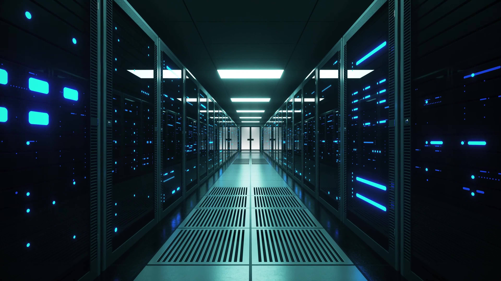

为什么要有双机房？

可能有几个考虑：

- 容灾：强如阿里云、微信、唯品会等，依然避免不了机房故障问题。一次这个级别的故障，就会有一个技术头头下野。

- 更快的响应：网络时延和物理距离成正比，用户距离服务越近，时延越友好 。不同的地域，多机房多活模式，就近提供服务。

# 一、双机房需要做什么？

## 1、一套完备的服务

完备的服务包括哪些？

应用服务实例，缓存服务实例、数据库服务实例、mq 服务实例等。

服务实例数量可以根据实际需要确定，不必要求安全对等，但是比例不能乱。

## 2、数据同步

数据的同步是至关重要的。数据是业务逻辑的承载和服务状态的基础。

数据同步强调准确性和实时性。 两个机房的数据根据不同的活性模式，数据域可能略有差异，但是相同的数据域必须要保障一致性。

## 3、服务就近调用

这里说的服务调用是指内部服务之间的访问需求，就近是指访问限定在机房域内，尽量避免跨机房调用。

服务调用主要分如下几个点：

### a）Http 方式

http 方式简洁，易用，是服务间交互的常用方式，通常使用内部域名（避免直接ip访问）访问。

双机房建设，则需要做好相应的适配。

### b）rpc 方式

rpc 方式则更侧重扩展性，可靠性，高效性等。通常有相应的服务框架及管理框架支持。

rpc 服务提供者和使用者通过服务注册中心进行服务注册发现交互。

双机房注册及发现，需要有相应的【就近策略】支持。

### c）mq 方式

mq 异步交互模式。

业务消息限制发送到同一机房，并由同一机房服务进行消费。

# 二、双机房的两种模式

## 1、灾备

灾备模式，即机房服务作为备用，不参与对外服务。一旦主机房发生故障，快速切换响应。

这种建设模式因为变更来源全部为主机房单向数据同步，所以比较容易实现。

灾备模式需要做什么？

灾备模式数据同步实时性要求没有那么高。更强调数据的最终一致性。

备机房服务节点可以直接作为备节点模式进行数据的同步。

## 2、双活

双活模式，即两个机房同时对外提供服务，同时对底层数据产生变更操作。

这种涉及的逻辑比较复杂，要求也相对较高，强要求数据同步实时性。

双活模式需要做什么？

### a）用户切割

所谓用户切割即，划分两个机房服务不同的用户群体。尽量是的同一个用户的数据变更都发生在同一个机房。

切割通常可以从网关层面进行流量调度。

调度策略可以基于用户属性层面考量，比如：地域、ID特性等。

### b）数据双向同步

数据双向同步，听着就麻烦，所以必须有 a）中的用户切割作为基础。

对于可能产生的同一数据的双相同步场景（数据冲突等），处理尤要慎重（基于时间戳、外部验证等前置验证方式）。