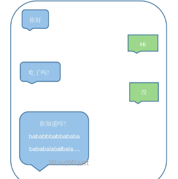

狭义地讲，性能是指软件在尽可能少地占用系统资源的前提下，尽可能高地提高运行速度。

谈及性能，我们的关注点不再是软件或者系统的功能，而是在其实现功能过程中所表现出来的资源效率。

# 一、池化思想

什么是池化？

简单的说就是设置一个公共对象池，对于其中的对象直接复用而不再使用新创建的方式。

### 1、JDK 的包装类型值缓存池

Integer::IntegerCache 整形包装类缓存

用于 [-128, 127] 之间数字装箱操作使用。最大值可以通过 "java.lang.Integer.IntegerCache.high" 设置。

第一次使用的时候初始化，其大小可以通过 -XX:AutoBoxCacheMax=<size> 进行设置。

Character::CharacterCache

缓存大小为 size = 127，即存储 [0, 127] 值域的 char 字符。

Long::LongCache 

缓存大小 size = -(-128) + 127，即存储 [-128, 127] 值域的 long 值。

Byte::ByteCache

缓存大小 size = -(-128) + 127，即存储 [-128, 127] 值域的 byte 值。

Short::ShortCache

缓存大小 size = -(-128) + 127，即存储 [-128, 127] 值域的 short 值。

### 2、Netty 内存池

Netty 支持通过内存池的方式循环利用 ByteBuf，避免了频繁的创建，销毁 ByteBuf 带来的资源及性能损耗。

ByteBuf byte 数据缓冲区，是NIO编程的主要对象。高负载情景下，ByteBuf 内存池使用，可以有效降低GC频率。

PoolArena Netty 的内存池实现类。PoolArena 是由多个 Chunk 组成的大块内存区域，每个 Chunk 由一个多个 Page 组成。

Chunk：组织管理 Page 的内存分配和释放，Page 被构建为二叉树形式：

PoolSubpage：对于小于 Page 的内存使用，直接在 Page 中完成分配，每个 Page 切分为大小相同的多个存储块儿，存储块儿的大小由第一次申请的内存块儿大小决定。

回收：Netty 使用状态位标识 Chunk 及 Page 内存可用性，Chunk 标识二叉树 Page 节点使用状态；Page 标识内部内存块儿的使用状态。

### 3、redis 共享对象池

当对象为整数且值在范围在[0-9999]时，redis 可以通过共享对象的方式来节省内存。

目前共享对象池只对整数设置了[0-9999]数据共享对象，一方面整数对象池复用率最大，同时等值判断上时间复杂度为O(1)。

### 4、线程池

线程的创建和销毁是一个非常重量级的操作，线程复用是加快服务响应的一个重要手段。

### 5、连接池

数据库连接池、Http 连接池等。

基于 TCP 的连接，其连接建立及断开需要经过三次握手及四次挥手的复杂交互过程。

# ... ...

# 二、缓存

缓存，即数据交换的缓冲区。通常来说，缓存数据存放于内存，因此拥有极高的数据操作效率。

### 1、数据存储缓存

数据的持久化存储一般依靠数据库、文件系统等存储介质。

直接的数据读取性能支撑有限，一般会设置分布式缓存或者本地缓存中间存储做热点数据响应。

### 2、Mysql 查询缓存

对于相同查询语句及相同查询条件的，Mysql 会使用首次缓存的结果进行相应。

同样的机制延伸到目前广泛使用的 Mybatis、Hibernate ORM 框架等。

### 3、Buffer

Kafka Buffer、Netty Buffer 等。

提供发送及接收缓冲区，网络数据发送及接收处理不再局限于实时。可以通过设定积攒一定的量后再去处理，并且或支持 Buffer 内容操作。

Mysql InnoDB 的 change buffer。

InnoDB 可以使用它的 change buffer（change buffer 的主要目的是将对二级索引的数据操作缓存下来，以此减少二级索引的随机IO，并达到操作合并的效果）来批量写二级索引记录。

### ... ...

# 三、内存分配

内存分配触及底层资源申请及使用，属于内存管理范畴内的优化。

内存分配方面的优化主要涉及内存分配次数及内存使用率等因素考量。

### 1、redis SDS

SDS 即 Simple Dynamic String， Redis 自定的字符串存储结构。 

Redis 在SDS内存配置策略上采用了【空间预分配】 + 【惰性删除】相结合的策略。

**空间预分配：** 

在一次 SDS 字符扩展操作中，扩展的空间大小会大于实际需要的空间大小。
  
预分配空间的大小基于以下规则计算：

SDS len<1M：分配len长度空间作为预分配空间；

SDS len>=1M：分配1M空间作为预分配空间；

**惰性删除：**

调整删除 SDS 中部分数据时，不会立刻执行内存重分配，而是会保留空出来内存，并更新内部 free 属性。以备将来有字符扩展需求，可以直接使用。

### 2、Netty 动态缓冲区分配

动态缓冲区分配器，源码说明：根据实时的反馈动态的增加或者减少预需的缓冲区大小。

如果上一次分配的缓冲区被填满了，则调高下一次分配的缓冲区大小。

如果连续两次实际使用的容量低于分配的缓冲区大小特定比例，则减小下一次分配的缓冲区大小。

其它情景，保持分配大小不变。

Netty 的这种“智能化”处理，可以说是相当有用的：

- 首先，实际的应用场景千差万别，同一场景下不同时刻的缓冲区需求也是实时变化（一句话可以是一个字，也可能是1000个字），这就需要 Netty 动态调整缓冲分配大小以适应不同的业务场景，时刻场景。

  

- 其次，过大的不必要的内存分配，会导致 Buffer 处理性能下降；过小的内存分配，则会导致频繁的分配释放。这都是一个优良的网络框架不应该有的。

- 最后，动态的调整最直接的好处就是内存的的高效使用，一定程度上做到了按需分配。

### 3、Memcached Slab Allocator

基于 Slab Allocator 内存分配机制。一个 slab 包含很多 page，一个 page 包含很多 chunk。
