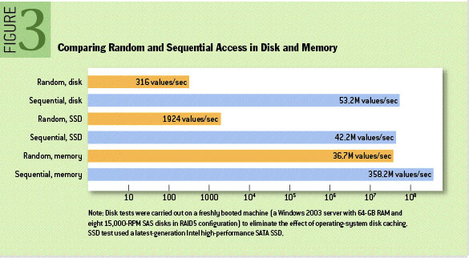
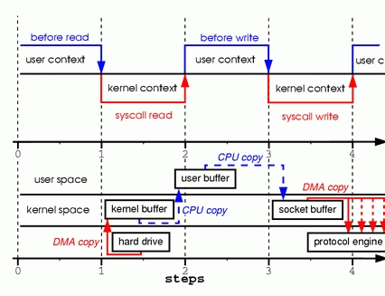

继续上一篇  文章，继续探讨高性能设计的一些点！

# 一、顺序访问

磁盘内容读取或写入操作都会涉及到一个【寻址过程】，首先找到需要读取写入的位置，然后去操作磁盘内容读写。

所谓顺序访问，就是将以存储连续的方式写入、读取磁盘内容。

下图为不同存储介质顺序、随机访问性能对比：

[图片来源](https://queue.acm.org/detail.cfm?id=1563874)

就好像快递员送货一样，它会实现规划好路线，一条线送过去，是最省时省力的。

### 1、kafka 

> Kafka 每条消息都会被 append 到相应的 partition 中，顺序写磁盘，效率非常高。是 Kafka 高吞吐率的一个很重要的保障。

### 2、MySQL

>Mysql 顺序读写类文件包括： InnoDB system tablespace 文件及 binary log 及 redo log 日志文件等

### ... ...

# 二、零拷贝

传统方式，数据从存储介质读取到发送到网络整个过程会涉及到多次数据拷贝及上下文切换操作，如下：

图上层为上下文切换过程，下层为拷贝过程。

- user context 切换到 kernel context；DAM engine 将数据从磁盘拷贝到内核。

- 数据从 kernel buffer 拷贝到 user buffer；kernel context 切换到 user context。

- user context 切换到 kernel context，数据从 user buffer 拷贝到 socket buffer。

- kernel context 切换到 user context，数据从 socket buffer 拷贝到 protocol engine。

**mmap 方式演进：**

用户进程共享 kernel buffer。

mmap 上线文切换过程不变，数据传输省略掉了 kernel buffer 和 user buffer 之间的拷贝过程，数据直接从 kernel buffer 拷贝到 socket buffer。

**Sendfile 方式演进：**

Read Write 过程由 Sendfile 机制替代。

**Zero copy：**

DMA 将数据从存储介质拷贝到 kernel buffer 后，不再做任何数据拷贝，直接将带有数据地址及长度信息的文件句柄追加至 socket buffer。

DMA engine 负责将数据从 kernel buffer 传送至 protocol engine。

[参考文献](https://www.linuxjournal.com/article/6345)

### 1、Kafka 

>TransferableRecords::writeTo 方法实现了 sendfile，更高效的实现消息的收发。

### 2、Netty

> 依赖于操作系统零拷贝特性直接将缓冲区数据发送到相应的通道。 netty 利用 NIO FileChannel transferTo 方法，通道对通道写数据。

# 三、异步非阻塞

异步的着眼点在于剥离主流程。

主流程继续执行主线任务，异步逻辑开辟支线处理。

### 1、IO

IO -> NIO -> AIO

### 2、异步逻辑

基于 EventBus 或者 消息队列进行异步逻辑任务的处理。

如记录操作记录，历史变更等信息。

